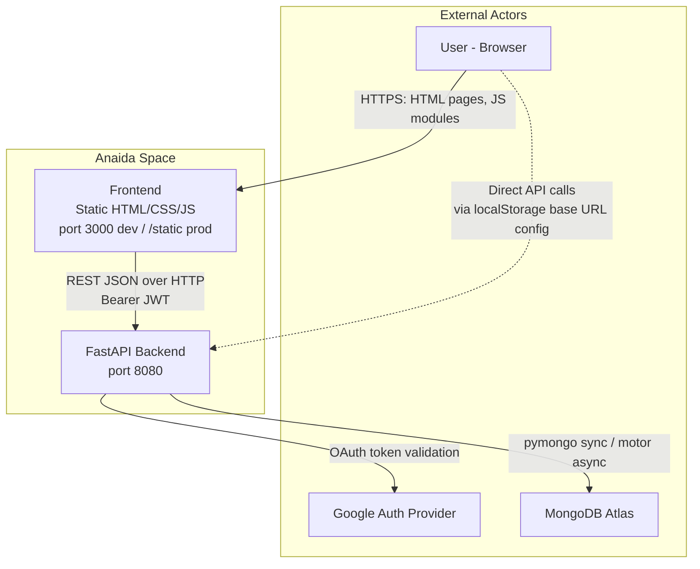
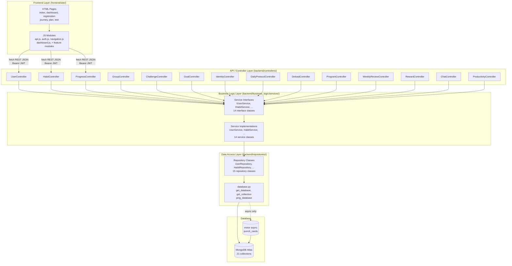
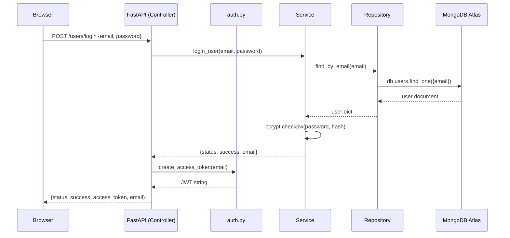
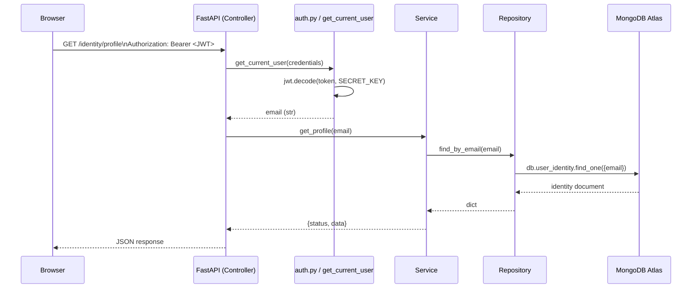
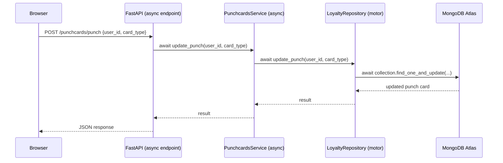

# Software Architecture Document — Anaida Space

## 1. Document Information

| Field       | Value                                      |
|-------------|--------------------------------------------|
| Version     | 1.0                                        |
| Date        | 2026-05-27                                 |
| Status      | Accepted                                   |
| Authors     | Solution Architecture Team                 |
| Project     | Anaida Space — Adaptive Self-Development Platform |
| Template    | Views and Beyond (V&B)                     |

---

## 2. System Context and Scope

### 2.1 Purpose

Anaida Space solves the psychological friction that prevents people from building lasting discipline. Existing habit trackers rely on gamification (points, badges, leaderboards) which produces engagement without genuine behavioral change. Anaida Space instead applies identity-based progression: a user's score represents *who they are becoming*, not how many actions they clicked. The platform combines daily protocols, 30-day structured programs, weekly reflection, community challenges, and productivity tools inside a single premium-minimalist experience.

### 2.2 Scope

**In scope:**
- User registration, authentication (email/password + Google OAuth), and profile management
- Habit creation, tracking, and progress logging
- Identity score calculation and level progression (Lost → Explorer → Builder → Disciplined → Focused → Elite)
- Daily protocol system (Minimum / Target / Bonus task structure)
- Streak tracking with automatic deload recovery days after every 7-day streak
- 30-day adaptive programs (START / RHYTHM / REINFORCEMENT phases)
- Weekly reflection reviews
- Community groups and challenge management (with proof submissions and moderation)
- Cosmetic reward unlocks tied to behavioral milestones
- Direct-message and challenge-linked chat
- Productivity suite: water tracker, daily planner, spaced-repetition flashcards, brainstorm boards
- Loyalty punch cards (async path)
- Assessment quiz for onboarding and roadmap generation

**Out of scope:**
- Native mobile applications (iOS / Android)
- Push / email notifications
- Payment processing or subscriptions
- AI-generated coaching content (beyond the static goal/phase task library)
- Video or file hosting (proof URLs are stored as external links only)
- Real-time WebSocket communication (all chat is polled)

### 2.3 System Context Diagram



### 2.4 Stakeholders and Concerns

| Stakeholder             | Primary Concerns                                                          |
|-------------------------|---------------------------------------------------------------------------|
| End users               | Trustworthy progress tracking; fast, reliable UI; data privacy            |
| Product owner           | Feature completeness; premium aesthetic; no gamification creep            |
| Backend developer       | Clear layered architecture; testability without a live database           |
| Frontend developer      | Stable API contracts; predictable JSON response shapes                    |
| DevOps / deployer       | Simple single-process production deployment; environment variable config  |
| Security auditor        | Secure credential storage; JWT secret management; CORS policy             |

---

## 3. Functional Requirements Summary

### 3.1 Core Features

| Feature Area        | Capability                                                                                   |
|---------------------|----------------------------------------------------------------------------------------------|
| Authentication      | Email/password register + login with bcrypt; Google OAuth; JWT-protected endpoints           |
| User Profile        | Profile fetch and update; quiz result storage (anonymous session or linked to account)       |
| Habits              | Create, list, delete habits; mark complete; streak calculation                               |
| Progress            | Log and retrieve habit completion events                                                     |
| Goals               | Assign a goal code to a user (focus_productivity, build_discipline, physical_health, etc.)  |
| Identity            | Score 0–100 from five weighted sub-components; level resolution; recalculation on demand     |
| Daily Protocol      | Create per-day Min/Target/Bonus task set; mark tasks complete; history retrieval            |
| Deload              | System-triggered recovery day after every 7-day streak; complete with a recovery activity   |
| 30-Day Program      | Start a program by goal + level; advance day by day through three phases; goal-aware tasks  |
| Weekly Review       | Submit structured reflection; history retrieval; contributes to identity score              |
| Rewards             | Catalog of cosmetic rewards; unlock check against milestones; activate to set active theme  |
| Groups              | Create, join, and list community groups                                                      |
| Challenges          | Create/update/delete challenges; register participants; submit proof; moderate submissions  |
| Chat                | Start DM conversations; send messages; challenge group chat threads                        |
| Productivity        | Water intake logging; daily planner tasks; spaced-repetition card decks; brainstorm boards  |
| Punch Cards         | Loyalty cards tracked via async motor path; punches increment on activity                  |
| Assessment Quiz     | Multi-question quiz producing a profile + roadmap; stored per-session or per-user           |

### 3.2 Quality Attribute Requirements (Functional)

- All API responses use a consistent envelope: `{"status": "success"|"error", "data": ..., "message": ...}`.
- Authentication is enforced on all personal data endpoints via FastAPI `Depends(get_current_user)`.
- Idempotent upserts are used for per-day documents (daily_protocols, deload_days, water_logs) to prevent duplicates on retry.

---

## 4. Non-Functional Requirements

### 4.1 Performance

**Requirement:** API endpoints targeting less than 200 ms p95 for simple reads; less than 500 ms for writes and compound queries. Frontend page load under 2 s on a standard broadband connection.

**Architectural approach:**
- MongoDB queries use targeted equality filters on `email` and `date` fields — low cardinality lookups by design.
- No N+1 patterns: all list endpoints fetch in a single `find()` call with a projection to limit data transfer.
- Static frontend assets are served directly by FastAPI's `StaticFiles` mount in production, bypassing Python logic for HTML/CSS/JS.
- The `dev.py` dual-server setup (uvicorn + `http.server`) introduces an extra HTTP hop in local development only; production collapses to a single FastAPI process.

**Known gap:** There are no HTTP-level caches (ETag, Cache-Control) configured. MongoDB indexes beyond the default `_id` are not explicitly defined in application code — indexes must be applied at the Atlas/database level manually.

### 4.2 Scalability

**Requirement:** The system must be deployable as a single-instance application initially. It should be possible to scale horizontally without architectural changes.

**Architectural approach:**
- JWT authentication is stateless — no server-side session store. Multiple FastAPI instances behind a load balancer require no session affinity.
- MongoDB Atlas provides horizontal scaling (sharding, read replicas) independently of application scaling.
- The `Container` class uses lazy-init singletons per-process. In a multi-worker uvicorn deployment, each worker gets its own `Container` and `MongoClient` instance. MongoDB driver connection pooling is handled per-client.
- `StaticFiles` can be offloaded to a CDN (e.g., Cloudflare) without code changes — just update the frontend `api.js` base URL via `localStorage`.

**Known gap:** No explicit MongoDB connection pool size configuration; PyMongo defaults apply (100 max connections). Under concurrent load from multiple uvicorn workers this should be revisited.

### 4.3 Availability

**Requirement:** 99.5% uptime target (approximately 44 hours downtime per year).

**Architectural approach:**
- The `/health` endpoint queries MongoDB with `ping` and returns `{"status": "degraded"}` on failure, enabling load balancers and health monitors to detect database loss.
- MongoDB Atlas provides managed replication and failover — the application layer has no replica-set awareness and relies entirely on Atlas.
- The application has no in-process caching layer; a MongoDB outage surfaces directly as 500-class errors on affected endpoints.

**Known gap:** No circuit breaker, retry logic, or graceful degradation for MongoDB failures beyond the health check response. Long-running requests will block on `serverSelectionTimeoutMS` (default 5000 ms).

### 4.4 Security

**Requirement:** User credentials must be stored hashed; API access must be authenticated; JWT secret must be configurable per environment.

**Architectural approach:**
- Passwords are hashed with bcrypt (12-round salts via `bcrypt.gensalt()`). A migration path exists: on login, if a stored plaintext password matches, it is silently rehashed. See ADR-007.
- JWTs are signed with HS256. The secret key is hardcoded as `"anaida-secret-key-change-in-production"` in `backend/auth.py`. **This must be replaced with an environment variable before any production deployment.**
- Token expiry is 30 days. There is no refresh token mechanism; expiry is enforced server-side on every protected request.
- CORS policy is currently set to `allow_origins=["*"]`. This is acceptable for early development but must be restricted to known origins in production.
- Passwords are excluded from all profile response projections (`{"_id": 0, "password": 0}`).

**Known gaps:** No rate limiting on login or registration endpoints (brute-force risk). No email verification flow. No password reset flow.

### 4.5 Maintainability

**Requirement:** New features must follow the existing Controller → Service → Repository pattern without modifying stable layers.

**Architectural approach:**
- Every service is defined behind a Python ABC interface (`IXyzService`) in `backend/business_logic/services/interfaces/`. This allows swapping implementations and injecting stubs in tests.
- All request DTOs are centralized in `backend/controllers/requests/requests.py` with re-exports in `__init__.py`, making them discoverable.
- Test coverage uses `unittest.TestCase` with `FakeXyzRepository` stubs (no live database). Tests run with `python -m pytest tests/`.
- Current test count: approximately 81 test methods across 12 test files.
- Naming inconsistency: original interface files use `*_imterface.py` (typo); new files use `*_interface.py`. Both patterns exist in the codebase.

### 4.6 Deployability

**Requirement:** A developer must be able to run the full stack locally with a single command. Production must be deployable without a separate frontend server.

**Architectural approach:**
- `python dev.py` starts both FastAPI (port 8080) and Python's built-in `http.server` (port 3000) as child processes. Ctrl-C terminates both cleanly via signal handlers.
- In production, FastAPI serves the static frontend from `frontend/site/` via `StaticFiles` mount at `/static` and the `index.html` root at `/app`. No separate web server is required.
- Configuration is driven entirely by environment variables with safe defaults — copy `.env.example`, set `MONGODB_URI`, and run.
- A Windows-specific `mklink /J` junction is created to link `frontend/site/img` to `frontend/img` at startup. This requires no elevated privileges.

### 4.7 Observability

**Requirement:** Operators must be able to determine service health and detect database connectivity issues.

**Architectural approach:**
- `/health` endpoint returns `{"status": "ok"|"degraded", "database": "connected"|"unavailable"}`. This is the primary health signal.
- FastAPI's default request logging (uvicorn access log) provides method, path, status code, and response time per request.
- OpenAPI documentation is auto-generated and available at `/docs` (Swagger UI) and `/redoc`.

**Known gap:** No structured application-level logging (no `logging` module integration, no log aggregation). No metrics endpoint (Prometheus/OpenTelemetry). No tracing.

---

## 5. Architecture Views

### 5.1 Module View (Component Decomposition)

#### Layer Diagram



#### Component Responsibilities

| Component | Package | Responsibility |
|-----------|---------|----------------|
| HTML Pages | `frontend/site/` | Static entry points; no server-side rendering |
| JS Modules | `frontend/site/js/modules/` | Feature-specific API calls, DOM manipulation, local state management |
| `api.js` | `frontend/site/js/modules/` | Central `apiRequest()` wrapper; configurable base URL via localStorage |
| `auth.js` | `frontend/site/js/modules/` | Login/logout/session restore; localStorage-backed session |
| Controllers | `backend/controllers/` | HTTP routing, request parsing, response shaping; thin — no business logic |
| Request DTOs | `backend/controllers/requests/` | Pydantic models for input validation; all in one file |
| Service Interfaces | `backend/business_logic/services/interfaces/` | ABC contracts; enable dependency injection and test stubbing |
| Service Implementations | `backend/business_logic/services/` | All business rules, domain logic, score calculations |
| Repositories | `backend/repositories/` | MongoDB CRUD operations; own collection references |
| `database.py` | `backend/repositories/` | Singleton MongoClient; `get_collection()` factory; `ping_database()` |
| `Container` | `backend/main.py` | Manual DI container; lazy-initializes all repositories and services |
| `auth.py` | `backend/` | JWT creation and verification; `get_current_user` FastAPI dependency |

#### Dependency Rules

- Controllers may import from `interfaces/` and `requests/` only — never from concrete service or repository classes.
- Services may import from `interfaces/` and `repositories/` only — never from controllers.
- Repositories may import from `database.py` only — never from services or controllers.
- `database.py` has no imports from other application layers.
- `Container` (in `main.py`) is the only location allowed to import and wire concrete implementations.

### 5.2 Component and Connector View (Runtime)

#### Standard Request Flow



#### Authenticated Request Flow



#### Async Path — Punch Cards (Motor)



All other service paths are synchronous (pymongo). The async motor path exists only for `LoyaltyRepository` → `punch_cards` collection. FastAPI handles both sync and async endpoints natively; no event loop management is required in application code.

#### Identity Score Recalculation

The identity score is not recalculated automatically on every request. Services that affect score components (DailyProtocolService, ProgramService, WeeklyReviewService) do not call IdentityService internally. Recalculation is triggered explicitly via `POST /identity/recalculate` from the client or can be called by another service via `IdentityService.update_component()`.

Score formula:
```
identity_score = (streak_score * 0.30)
               + (habit_completion_score * 0.30)
               + (protocol_score * 0.20)
               + (weekly_review_score * 0.10)
               + (program_score * 0.10)
```

All component scores are clamped 0–100. Final score maps to level via threshold table:

| Score Range | Level       |
|-------------|-------------|
| 90–100      | Elite       |
| 75–89       | Focused     |
| 60–74       | Disciplined |
| 40–59       | Builder     |
| 20–39       | Explorer    |
| 0–19        | Lost        |

### 5.3 Deployment View

#### Local Development

```
Developer Machine
├── python dev.py
│   ├── uvicorn backend.main:app --reload --host 127.0.0.1 --port 8080
│   │   └── FastAPI app + all routes + /static mount
│   └── python -m http.server 3000 --directory frontend/site/
│       └── Serves HTML/CSS/JS directly (no API calls)
│
├── Browser → http://127.0.0.1:3000  (frontend, CORS allowed from *)
└── Browser → http://127.0.0.1:8080  (API, Swagger at /docs)
```

- `dev.py` manages both processes as subprocesses, forwards SIGINT/SIGTERM, and waits for clean exit.
- On Windows, a directory junction `frontend/site/img` → `frontend/img` is created at startup via `mklink /J`.
- The frontend's `api.js` defaults to `http://localhost:8080`. This can be overridden in browser localStorage (`anaida_api_base_url`).

#### Production (Single-Server)

```
Production Server
└── uvicorn backend.main:app --host 0.0.0.0 --port 8080 [--workers N]
    ├── GET /           → {"message": "backend API is running"}
    ├── GET /app        → FileResponse: frontend/site/index.html
    ├── GET /static/*   → StaticFiles: frontend/site/
    ├── GET /health     → {status, database}
    ├── GET /docs       → Swagger UI
    └── /users, /habits, /identity, ... → API routes
```

The frontend at `/app` and static assets at `/static` are served by FastAPI directly. No Nginx or separate web server is required, though one can be placed in front for TLS termination and gzip compression.

**Environment variables for production:**

| Variable           | Required | Description                                      |
|--------------------|----------|--------------------------------------------------|
| `MONGODB_URI`      | Yes      | MongoDB Atlas SRV connection string              |
| `MONGODB_DB_NAME`  | No       | Database name (default: `habitplatform`)         |
| `MONGODB_TIMEOUT_MS` | No     | Server selection timeout ms (default: `5000`)    |

The JWT secret (`SECRET_KEY` in `backend/auth.py`) is hardcoded and **must be moved to an environment variable** before production use.

#### Containerization (Not Yet Implemented)

A minimal `Dockerfile` would require:
```
FROM python:3.11-slim
WORKDIR /app
COPY backend/ backend/
COPY frontend/ frontend/
COPY requirements.txt .
RUN pip install -r backend/requirements.txt
ENV MONGODB_URI=""
CMD ["uvicorn", "backend.main:app", "--host", "0.0.0.0", "--port", "8080"]
```

No containerization is present in the current codebase.

### 5.4 Data View

#### Collection Schema Summaries

**users**
```
{
  _id: ObjectId,
  email: str (unique key),
  password: str (bcrypt hash),
  name: str,
  auth_provider: "email" | "google",
  verified: bool,
  created_at: ISO-8601 str,
  quiz_profile: dict (optional),
  quiz_roadmap: dict (optional),
  quiz_answers: list (optional),
  quiz_session_id: str (optional),
  quiz_saved_at: ISO-8601 str (optional),
  google_id: str (optional),
  picture: str (optional)
}
```

**quiz_results** — anonymous (no email) or pre-registration quiz sessions
```
{ session_id: str, email: str|null, answers: list, profile: dict, roadmap: dict, saved_at: ISO-8601 }
```

**userHabits**
```
{ _id: ObjectId, userId: str, name: str, description: str }
```

**progress**
```
{ _id: ObjectId, userId: str, habitId: str, completedAt: ISO-8601 }
```

**goals**
```
{ _id: ObjectId, email: str, goal_code: str, assigned_at: ISO-8601 }
```

**groups**
```
{ _id: ObjectId, name: str, members: [str] (emails) }
```

**posts** (challenge posts and group posts)
```
{ _id: ObjectId, groupId: str, title: str, participants: [str], is_active: bool, start_date: str, end_date: str, registration_deadline: str, description: str }
```

**challenge_submissions**
```
{ _id: ObjectId, challenge_id: str, user_email: str, day: int, proof_url: str, status: "pending"|"approved"|"rejected", submitted_at: ISO-8601 }
```

**user_identity**
```
{ email: str, identity_score: float, identity_level: str, next_level: str, progress_to_next: float, streak_score: float, habit_completion_score: float, protocol_score: float, weekly_review_score: float, program_score: float, last_calculated_at: ISO-8601 }
```

**daily_protocols**
```
{ email: str, date: "YYYY-MM-DD", minimum_task: {title, completed}, target_task: {title, completed}, bonus_task: {title, completed}, points_earned: int, streak_counts: bool }
```

**deload_days**
```
{ email: str, date: "YYYY-MM-DD", trigger_streak: int, activity_chosen: str|null, completed: bool, completed_at: ISO-8601|null, points_earned: int }
```

**user_programs**
```
{ email: str, goal_code: str, level: "beginner"|"medium"|"advanced", start_date: "YYYY-MM-DD", current_day: int, current_phase: "START"|"RHYTHM"|"REINFORCEMENT", status: "active"|"completed", completed_days: [int], total_days: 30, created_at: ISO-8601 }
```

**weekly_reviews**
```
{ email: str, week_start: "YYYY-MM-DD", what_worked: str, what_distracted: str, what_to_change: str, submitted_at: ISO-8601 }
```

**user_rewards**
```
{ email: str, unlocked: [str] (reward codes), active_theme: str, active_avatar_frame: str, active_background: str, active_focus_room: str, unlocked_at: {code: ISO-8601} }
```

**conversations**
```
{ _id: ObjectId, type: "dm"|"challenge"|"coach", participants: [str] (emails), challenge_id: str (optional), last_message: str, last_message_at: ISO-8601 }
```

**messages**
```
{ _id: ObjectId, conversation_id: str, sender_email: str, content: str, sent_at: ISO-8601, read_by: [str] }
```

**water_logs**
```
{ email: str, date: "YYYY-MM-DD", glasses: int, goal: int, logs: [{amount_ml, logged_at}] }
```

**planner_tasks**
```
{ _id: ObjectId, email: str, date: "YYYY-MM-DD", title: str, description: str, priority: "high"|"medium"|"low", time_slot: str, completed: bool, created_at: ISO-8601 }
```

**sr_cards** (spaced repetition)
```
{ _id: ObjectId, email: str, deck: str, front: str, back: str, ease_factor: float, interval_days: int, repetitions: int, next_review_date: "YYYY-MM-DD" }
```

**brainstorm_sessions**
```
{ _id: ObjectId, email: str, title: str, ideas: [{content, added_at}], tags: [str], created_at: ISO-8601, updated_at: ISO-8601 }
```

**punch_cards**
```
{ _id: ObjectId, user_id: str, card_type: str, punches_earned: int, last_punch_at: datetime, is_completed: bool }
```

#### Data Relationships

All collections that represent per-user data use `email` (string) as the cross-collection foreign key. There are no explicit referential integrity constraints — MongoDB does not enforce them, and the application relies on business logic to maintain consistency.

Relationship map:
```
users.email
  ├── user_identity.email
  ├── daily_protocols.email
  ├── deload_days.email
  ├── user_programs.email
  ├── weekly_reviews.email
  ├── user_rewards.email
  ├── goals.email
  ├── water_logs.email
  ├── planner_tasks.email
  ├── sr_cards.email
  ├── brainstorm_sessions.email
  ├── conversations.participants[] (array contains email)
  ├── conversations.type="coach" (one system-generated thread per user)
  └── messages.sender_email

userHabits.userId  →  (userId is currently a string, not email — inconsistency)
progress.userId    →  (same inconsistency — uses userId not email)
punch_cards.user_id → (separate identifier, not email)
posts._id (str)    ←  challenge_submissions.challenge_id
```

**Note:** The habit and progress subsystems use `userId` (a legacy string field) rather than `email`, diverging from the email-as-identity pattern used by all newer collections. This is an existing inconsistency, not a design choice for new features.

#### No-ORM Trade-offs

The system uses raw pymongo dictionaries throughout. There are domain model classes in `backend/domain/models/` (using Pydantic), but repositories do not use them — they operate directly on `dict`. This means:
- **Pro:** No ORM overhead; full control over MongoDB queries and projections.
- **Pro:** Flexible schema evolution — fields can be added without migrations.
- **Con:** No automatic validation of data written to MongoDB; the repository layer trusts its callers.
- **Con:** `_id` (ObjectId) must be manually converted to `str` before returning in responses; this is done inconsistently — some repositories do it, some do not.
- **Con:** The chat layer now includes one system-generated coach thread per user; the application must keep that thread idempotent so users do not receive duplicate coach conversations.

---

## 6. Architecture Decisions

### ADR-001: MongoDB (NoSQL) over Relational Database

**Status:** Accepted

**Context:** The platform stores a heterogeneous mix of data shapes per user: quiz profiles, daily protocol tasks, program phases, brainstorm idea trees, spaced repetition card schedules. A relational schema would require many tables with complex joins for what are essentially per-user document read patterns.

**Decision:** Use MongoDB Atlas as the sole data store. Use pymongo for synchronous operations and motor for the punch card async feature.

**Consequences:**
- Pro: Schema flexibility allows adding fields to documents without migrations.
- Pro: Each collection maps directly to one domain concept; queries are simple find/upsert by email + date.
- Pro: Atlas handles replication, backups, and cluster management.
- Con: No foreign key enforcement — cross-collection consistency must be maintained in application code.
- Con: No ACID transactions across collections (used nowhere in the current codebase).
- Con: Poor fit for relational queries (e.g., joining leaderboard data across users and challenges requires multiple round-trips).

---

### ADR-002: Email as Primary User Identifier

**Status:** Accepted

**Context:** The system needed a stable, human-readable user identity across all collections. Using MongoDB's `ObjectId` as a cross-collection key would require storing and passing opaque IDs everywhere, including in JWTs and API payloads.

**Decision:** Use the user's email address as the primary join key across all collections. JWTs encode only the email in the `sub` claim. All service methods accept `email: str` as the user identifier.

**Consequences:**
- Pro: Readable, debuggable — logs and database documents are self-explanatory.
- Pro: Consistent pattern across the 14 service classes.
- Con: Email change requires updating every collection where the email appears — currently `update_user_profile` only updates the `users` document, not dependant collections. This is a known data consistency risk.
- Con: Email is case-sensitive in the current implementation; no normalization is applied (e.g., `User@Example.com` vs `user@example.com` would be treated as different users).
- Con: The habit and progress subsystems predate this decision and use `userId` instead — they are inconsistent with the pattern.

---

### ADR-003: Plain Vanilla JS Over a Framework

**Status:** Accepted

**Context:** The frontend is an aesthetics-first premium web experience. A framework (React, Vue, Svelte) would add build tooling complexity, a learning curve for the design-focused team, and bundle overhead.

**Decision:** Use native ES Modules (import/export), the Fetch API, and direct DOM manipulation. No build step, no bundler, no transpiler.

**Consequences:**
- Pro: No build pipeline — edit a `.js` file, refresh the browser.
- Pro: Full control over DOM structure; no virtual DOM reconciliation surprises.
- Pro: Zero JavaScript framework dependencies — no supply chain risk from npm.
- Con: No component model — shared UI patterns (modals, toasts, tabs) are duplicated across page scripts.
- Con: No reactive state management — UI updates require imperative DOM manipulation.
- Con: No TypeScript — type errors in API payloads are discovered at runtime.
- Con: Browser compatibility is limited to modern ES Module support (no IE11).

---

### ADR-004: Layered Architecture — Controller → Service → Repository

**Status:** Accepted

**Context:** The codebase needed a consistent structure that would allow new features to be added without disturbing stable layers and that would support unit testing without a live database.

**Decision:** Enforce a strict four-layer architecture: HTTP Controllers handle routing; Services implement business logic via injected interfaces; Repositories own database access; MongoDB is the sole data store. A `Container` class in `main.py` wires everything together via manual dependency injection.

**Consequences:**
- Pro: Services are fully testable with `FakeXyzRepository` stubs — no mocking frameworks needed.
- Pro: Adding a new feature follows a clear recipe: create interface → create service → create repository → create controller → register in Container.
- Pro: Swapping the database backend (e.g., to PostgreSQL) would only require new repository implementations.
- Con: More boilerplate per feature than a simple route-handler approach.
- Con: The Container is a manual service locator — it does not use a DI framework, so adding cross-service dependencies (e.g., ChatService needing UserRepository) requires careful manual wiring.

---

### ADR-005: JWT for Stateless Authentication

**Status:** Accepted

**Context:** The API needed to authenticate requests without server-side session storage, to keep the backend stateless and horizontally scalable.

**Decision:** Issue HS256-signed JWTs on login, encoding the user's email in the `sub` claim with a 30-day expiry. Validate on every protected request via `get_current_user` FastAPI dependency. Store JWT in the browser (the frontend stores only the email in localStorage; the token itself is not persisted across page loads in the current implementation — see Known Gaps).

**Consequences:**
- Pro: No session store — any server instance can validate any token.
- Pro: FastAPI's `Depends` system makes authentication declarative on each endpoint.
- Con: The JWT secret is hardcoded in source code. **Production risk: must be moved to an environment variable.**
- Con: No token revocation mechanism — a stolen token is valid until expiry (30 days).
- Con: The frontend's `auth.js` stores only the email, not the JWT. On page reload, the user appears logged in (email in localStorage) but subsequent API calls would fail without the token. This behavior is inconsistent and is a known frontend bug.

---

### ADR-006: Motor (Async) for Punch Cards Only

**Status:** Accepted

**Context:** FastAPI supports both sync and async route handlers natively. The punch card feature was introduced after the main synchronous stack was established. Full migration of all pymongo calls to motor would require significant refactoring.

**Decision:** Use motor (AsyncIOMotorDatabase) only for the punch card feature (`LoyaltyRepository`). All other repositories continue to use pymongo synchronous operations.

**Consequences:**
- Pro: Punch card endpoints are non-blocking — important if the feature is used in high-frequency scenarios.
- Pro: No disruption to the existing synchronous codebase.
- Con: Two database driver patterns in the same codebase increase cognitive overhead.
- Con: The `LoyaltyRepository` requires a motor `AsyncIOMotorDatabase` instance injected at construction — it is not wired through the main `Container` class (the `PunchcardsService` and its controller live in separate files not registered in Container). This creates a discoverability gap.

---

## 7. Cross-Cutting Concerns

### 7.1 Authentication and Authorization

**Authentication** is handled by `backend/auth.py`. Every protected endpoint declares `current_user: str = Depends(get_current_user)` in its signature. If the `Authorization: Bearer <token>` header is absent or invalid, FastAPI returns HTTP 401 before the controller body executes.

**Authorization** is coarse-grained: any authenticated user can access any other user's data if they know the email. The system does not enforce row-level security — a request for `GET /identity/profile?email=other@user.com` with a valid JWT will succeed. This is a security gap for a multi-tenant system. The intended use assumes client-side enforcement (the frontend always sends the logged-in user's email).

**Public endpoints** (no JWT required): `/users/login`, `/users/register`, `/users/test-result`, `/challenges/` (GET), `/challenges/create`, `/health`, `/`, `/docs`.

### 7.2 Error Handling

All service methods return a consistent envelope:
```python
{"status": "success", "data": ..., "message": ...}
{"status": "error", "message": "..."}
```

Services wrap all logic in `try/except Exception as e` and return an error envelope rather than raising. Controllers do not explicitly handle these error envelopes — they return them directly as HTTP 200 responses, even for logical errors. Only structural/validation errors (Pydantic validation failure, missing path parameters) return non-200 HTTP status codes automatically via FastAPI.

**Gap:** Business logic errors (e.g., "user not found") return HTTP 200 with `{"status": "error"}` rather than HTTP 4xx. This violates REST conventions and complicates client-side error handling.

### 7.3 Logging and Monitoring

- Uvicorn access logs provide request-level visibility (method, path, status, duration).
- No application-level structured logging (`logging` module is not used).
- No metrics or tracing.
- The `/health` endpoint is the only operational signal beyond access logs.

### 7.4 Configuration Management

- All runtime configuration is via environment variables with hard-coded defaults.
- `.env.example` documents the expected variables. `.env` is loaded by `database.py`'s `load_env_file()` at module import time.
- The JWT secret is **not** an environment variable — it is hardcoded in `backend/auth.py`. This must be corrected before production deployment.
- CORS `allow_origins=["*"]` is hardcoded in `main.py` — must be restricted to known origins in production.

---

## 8. Constraints and Risks

### 8.1 Known Technical Debt

| Item | Location | Risk | Migration Path |
|------|----------|------|----------------|
| Hardcoded JWT secret | `backend/auth.py` line 6 | Critical: token forgery if source is exposed | Move to `os.getenv("JWT_SECRET_KEY")` |
| Hardcoded CORS `*` | `backend/main.py` line 226 | Medium: any origin can call the API | Add env-var-driven allowed origins list |
| `userId` vs `email` inconsistency | `userHabits`, `progress` collections | Medium: habit/progress data cannot be joined to user identity by email | Migrate field name or add email field to these collections |
| `_id` ObjectId serialization | Multiple repositories | Low: some endpoints return ObjectId objects that fail JSON serialization | Standardize `str(doc["_id"])` in all repository list methods |
| PunchcardsService not in Container | `backend/controllers/punchcards_repository.py` | Low: feature is not wired to DI container | Register in Container following standard pattern |
| Interface file typo | `*_imterface.py` (4 files) | Low: inconsistent naming | Rename files and update imports |

### 8.2 Missing Features

| Feature | Impact | Notes |
|---------|--------|-------|
| Email verification | Medium: fake accounts can be created | No flow implemented; `verified` field exists but is always `False` |
| Password reset | High: users locked out if password forgotten | No endpoint or email sending capability |
| JWT token in localStorage persistence | Medium: users must log in after page reload | `auth.js` stores email but not JWT token |
| Rate limiting on auth endpoints | High: brute-force vulnerability | No middleware or per-IP limits |
| Input sanitization beyond Pydantic | Low | Pydantic validates types and lengths but not injection patterns |
| Authorization (row-level security) | Medium: any user can read any other user's data by email | Acceptable for private beta; must be addressed before public launch |

### 8.3 Scaling Risks

| Risk | Likelihood | Severity | Mitigation |
|------|------------|----------|------------|
| Email change cascades | Low | High | Email changes currently update only `users` collection; all other collections retain the old email as the foreign key |
| MongoDB connection exhaustion | Medium | Medium | No explicit `maxPoolSize` configured; default PyMongo pool (100) × worker count could exceed Atlas tier limits |
| Single-process write bottleneck | Low | Low | All writes are synchronous pymongo; uvicorn `--workers N` creates N independent pools |
| Identity score staleness | Medium | Low | Score is not auto-recalculated on habit/protocol completion; the client must call `/identity/recalculate` explicitly |
| No database indexes defined in code | Medium | Medium | Queries filter on `email`, `date`, and `status` fields that lack explicit indexes; performance degrades as collections grow |

---

## 9. Glossary

| Term | Definition |
|------|------------|
| **Identity Score** | A 0–100 float computed from five weighted sub-scores (streak 30%, habit completion 30%, protocol 20%, weekly review 10%, program 10%). Stored in `user_identity`. |
| **Identity Level** | A human label mapped from the identity score: Lost (0–19), Explorer (20–39), Builder (40–59), Disciplined (60–74), Focused (75–89), Elite (90–100). |
| **Daily Protocol** | A per-day document containing three named tasks — Minimum (1 pt), Target (2 pt), Bonus (3 pt). A day's streak counts only when the Minimum task is completed. |
| **Streak** | The count of consecutive days on which at least the Minimum protocol task was completed. Resets to 1 (not 0) on a missed day. |
| **Deload Day** | A recovery day created automatically after every 7-day streak. The user chooses one light activity (meditation, walk, bath, social time, digital detox) to preserve their streak. |
| **30-Day Program** | A user-initiated structured journey tied to a goal code and difficulty level. Divided into three phases: START (days 1–7), RHYTHM (days 8–21), REINFORCEMENT (days 22–30). Each day provides goal-specific and level-specific tasks. |
| **Phase** | One of three segments within a 30-day program: START (foundation / micro habits), RHYTHM (consistency / weekly review), REINFORCEMENT (peak intensity / final reflection). |
| **Goal Code** | A string identifier for a user's primary objective, e.g., `focus_productivity`, `build_discipline`, `physical_health`, `studying`, `mental_balance`. Used to select program tasks. |
| **Weekly Review** | A structured three-question reflection (what worked, what distracted, what to change) submitted weekly. Contributes 10% to identity score. |
| **Reward** | A cosmetic unlock (avatar frame, profile theme, background, focus room) triggered by behavioral milestones (streak length, program completions, review count). No functional gameplay effect. |
| **Quiz / Assessment** | An onboarding questionnaire that generates a user profile dict and a roadmap dict. Stored anonymously (by `session_id`) or linked to a user account by email. |
| **Punch Card** | A loyalty card tracking up to 10 punches of a given type per card. Managed via the async motor path. |
| **Spaced Repetition (SR)** | A study technique where flashcard review intervals grow based on self-reported recall quality (SM-2 algorithm via ease factor and interval fields). |
| **Container** | The manual dependency injection container in `backend/main.py`. Instantiates all repositories and services lazily on first use. |
| **Interface** | An abstract base class (`ABC`) in `backend/business_logic/services/interfaces/` that defines the contract a service must fulfill. Enables test stubbing without live MongoDB. |
| **FakeRepository** | A test double used in `tests/` — an in-memory dict-based implementation of a repository interface, allowing service logic to be tested without a database connection. |
| **Deload Activity** | One of five valid recovery activity types for a deload day: `meditation`, `walk`, `bath`, `social_time`, `digital_detox`. |
| **bcrypt migration** | The on-login process by which a plaintext-stored password (legacy) is detected, verified, and silently rehashed to a bcrypt hash without requiring user action. |
